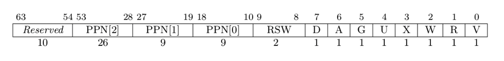

## 简单总结实现的功能
在实验lab2(ch4)中，重新实现了基于虚存的原有系统调用`sys_get_time`和`sys_task_info`，并新增了两个简化的系统调用`sys_mmap`和`sys_munmap`。其中`sys_mmap`实现了给定起始虚拟地址（按页对齐）、字节长度、页访问权限情况下的内存分配映射；`sys_munmap`则实现了给定起始虚拟地址、字节长度情况下的内存释放。
## 问答作业
1. 页表项分析
    > 1.1 请列举 SV39 页表页表项的组成，描述其中的标志位有何作用？
    
    D: Dirty，标志自从上次被清零至今，是否已经被写过。
    A: Accessed，标志自从上次被清零至今，是否被访问过。
    G: Global，标志该页是否是全局页。如果为 1，则表示该页是全局页，可以在所有地址空间中共享。如果为 0，则表示该页是局部页，只在当前地址空间中有效。
    U: User，标志该页是否可以被用户态访问。
    X/W/R: Execute/Write/Read，标志该页的访问权限。
    V: Valid，标志该页是否有效。
2. 缺页分析
   > 2.1 请问哪些异常可能是缺页导致的？
   > - 访问被换出的页面
   > - 内存映射文件过程中页面未被加载进内存
   > - 访问非法虚拟地址

   > 2.2 发生缺页时，描述相关重要寄存器的值，上次实验描述过的可以简略。
   > - sstatus：表示哪个状态（S/U）发生的缺页。当前值应该为User。
   > - sepc：发生缺页前的最后一条指令地址。
   > - satp：记录当前程序的根页表首地址。
   > - scause：异常原因，此时应为缺页异常。

   > 2.3 保存 .text 段在磁盘的位置信息，等到真正使用的时候才把页面读入的好处是什么？
   > - 节省内存空间，不需要一次性读入所有页面。
   > - 加快程序的加载速度，减少程序启动时间。

   > 2.4 处理 10G 连续的内存页面，对应的 SV39 页表大致占用多少内存 (估算数量级即可)？ 
   > &nbsp;&nbsp;&nbsp;&nbsp;答：10G需要占用10G/4K=2560个物理页面，需要二级页表数为：2560/512=5个，一个一级页表。也即是1+5=6个页表即可表示10G内存，采用Lazy情况下，需要6*4KB=24KB。

   > 2.5 请简单思考如何才能实现 Lazy 策略，缺页时又如何处理？描述合理即可，不需要考虑实现。 
   > &nbsp;&nbsp;&nbsp;&nbsp;答：在`sys_mmap`时，不进行真实的物理内存分配，只是把`MapArea`表示出来即可。在实际访存的时候，发生缺页，在`trap_handler`中缺页处理中，判断是否存在此次虚拟地址是否是有效地址，如果不是则抛出异常退出；如果是正常访问的地址，在此处进行物理页分配，并填入映射结构`BTreeMap`中。

   > 2.6 缺页的另一个常见原因是 swap 策略，也就是内存页面可能被换到磁盘上了，导致对应页面失效。此时页面失效如何表现在页表项(PTE)上？ 
   > &nbsp;&nbsp;&nbsp;&nbsp;答：页表项中的V(Valid)标志位可以表示该页是否有效，此时可以将Valid清零。
3. 单双页表分析
   > 3.1 在单页表情况下，如何更换页表？
    &nbsp;&nbsp;&nbsp;&nbsp;答：考虑使用基址寄存器。
   > 3.2 单页表情况下，如何控制用户态无法访问内核页面？
   &nbsp;&nbsp;&nbsp;&nbsp;答：将页表项的标志位U(User)清零即为内核态才可访问状态，为1则为用户态内核态均可访问。
   > 3.3 单页表有何优势？
   &nbsp;&nbsp;&nbsp;&nbsp;答：便于管理、访存速度快、节省系统开销
   > 3.4 双页表实现下，何时需要更换页表？假设你写一个单页表操作系统，你会选择何时更换页表？
   &nbsp;&nbsp;&nbsp;&nbsp;答：任务切换时、特权级转换时（系统调用）。单页表操作系统在任务切换时需要更换页表。

## 荣誉准则
1. 在完成本次实验的过程（含此前学习的过程）中，我曾分别与 以下各位 就（与本次实验相关的）以下方面做过交流，还在代码中对应的位置以注释形式记录了具体的交流对象及内容：无。
2. 此外，我也参考了 以下资料 ，还在代码中对应的位置以注释形式记录了具体的参考来源及内容：无。
3. 我独立完成了本次实验除以上方面之外的所有工作，包括代码与文档。 我清楚地知道，从以上方面获得的信息在一定程度上降低了实验难度，可能会影响起评分。
4. 我从未使用过他人的代码，不管是原封不动地复制，还是经过了某些等价转换。 我未曾也不会向他人（含此后各届同学）复制或公开我的实验代码，我有义务妥善保管好它们。 我提交至本实验的评测系统的代码，均无意于破坏或妨碍任何计算机系统的正常运转。 我清楚地知道，以上情况均为本课程纪律所禁止，若违反，对应的实验成绩将按“-100”分计。